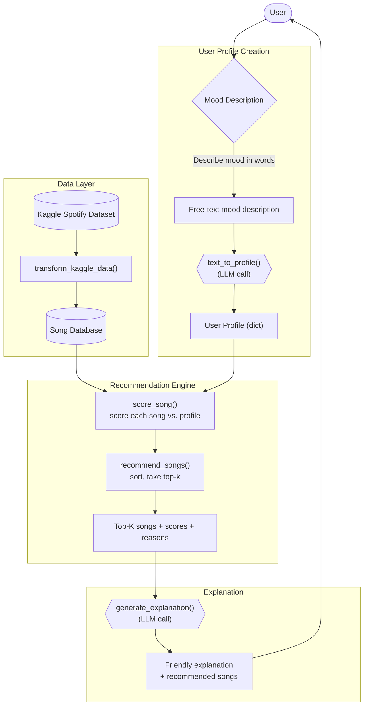

# System Diagram

Hexagon nodes (`text_to_profile()`, `generate_explanation`) marks where
an LLM call replaces deterministic functional code — everything else in the
pipeline is a pure function operating on plain dicts/lists.
